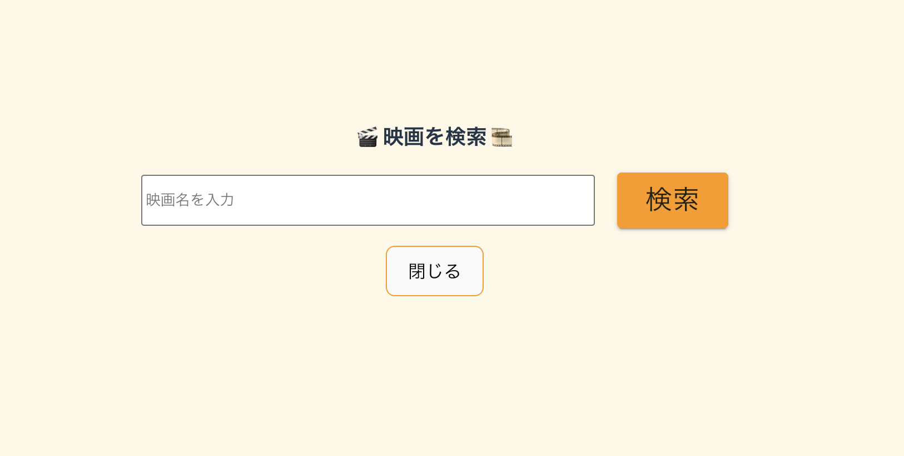

# 🎬 映画レビューサイト

次にあなたの人生が変わる映画は、ここで出会えるかもしれません。

## 💡 プロジェクト概要

- このプロジェクトは、映画のレビューを投稿・閲覧できるフルスタック Web アプリです。
- ユーザーは映画を検索してレビューを投稿したり、他のユーザーのレビューを閲覧したりできます。

- フロントエンド：React + MUI
- バックエンド：Node.js + Express
- データベース：PostgreSQL + Knex
- API：TMDB API https://www.themoviedb.org/

## ⚙️ 主な機能

- 映画検索
- 映画のレビュー投稿
- 投稿済みのレビューの一覧表示
- レビューの一覧表示からタイトル検索

## 事前準備

データベースの構築

```sh
psql
CREATE DATABASE moviedb;
\q
```

- .env ファイルの作成（USER や PASSWORD など必要に応じて記述してください）
- API キーの取得は TMDB 公式サイトから簡単にできます => https://www.themoviedb.org/

```sh
DB_HOST=localhost
DB_PORT=5432
DB_USER=<DBユーザー>
DB_PASSWORD=<DBパスワード>
DB_NAME=<データベース名>
TMDB_API_KEY=<TMDBのAPIキー>
```

ビルドコマンドの実行

```sh
npm run build
```

サーバ起動

```sh
npm start
cd /front
npm start
```

# ホームページ


#検索ぺーじ

